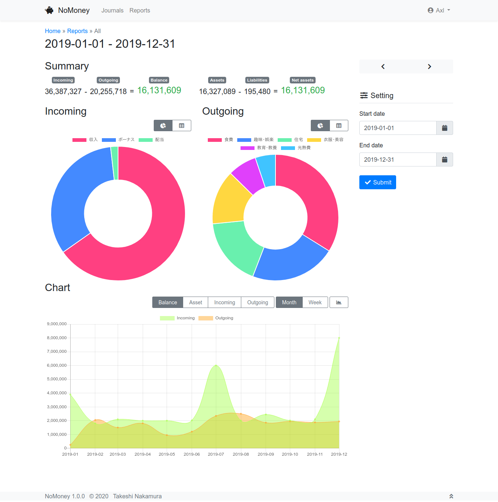

*Read this in other languages: [English](README.md)*

# NoMoney

NoMoneyはDjangoで作られたシンプルな家計簿です。(妻のために作りました。)

複式簿記の考え方が取り入れられています。
(素人なので、何かが間違っているかもしれません。)

## 要件

* Python 3.7+
* Django 3.0
* PostgreSQL 9.5+

## インストール

### データベース

NoMoney用のデータベースを用意します。

### NoMoney

1. NoMoneyをクローンまたはコピーします。
2. NoMoneyのディレクトリに移動し、`pip3 install -r requirements.txt`
を実行して、必要なライブラリをインストールします。
3. あたなの環境に合わせて、`config/settings.py` を修正します。
4. `python3 manage.py migrate` を実行して、マイグレーションします。
5. `django-admin compilemessages` を実行して、.po ファイルをコンパイルします。

### Webサーバ

Webサーバを設定してください。

[Django をデプロイする](https://docs.djangoproject.com/ja/3.0/howto/deployment/)
を参考にしましょう。

## 使い方

### 科目の設定

まずは管理画面から科目を追加します。例えば、以下のように追加しましょう。

| 名前             | 科目 |
|------------------|------|
| 給料             | 収入 |
| 現金             | 資産 |
| クレジットカード | 負債 |
| 食費             | 支出 |
| 衣服・美容       | 支出 |
| ...              | ...  |

### 記録

お金のやりとりが発生したら、
「新しい記録」をクリックして、データを入力します。

### レポート

まとめが知りたくなったら、「レポート」ページを開いてください。

## ライセンス

[MIT](LICENSE)

## 作者

なかむら たけし
