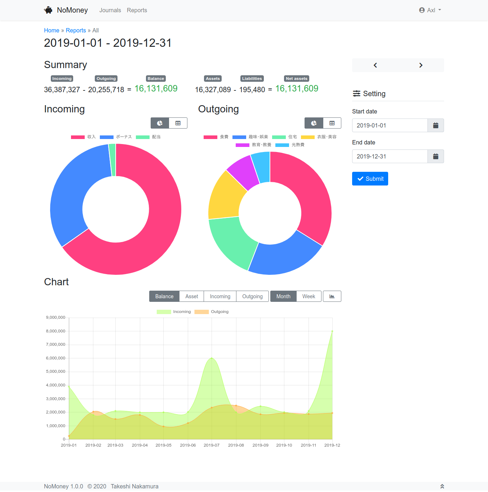

*Read this in other languages: [日本語](README.ja.md)*

# NoMoney

NoMoney is a simple household account book (for my wife).
This application is implemented by Django.

The way of booking is based on double-entry bookkeeping system.



## Requirements

* Python 3.12+
* Django 5.2
* PostgreSQL 18+

## Installation

### Docker Compose


1. Clone or copy files of NoMoney.
2. Run `docker compose build` to build Docker image.
3. Create directories for static files and media by:
```bash
groupadd -r nomoney
mkdir -p /var/opt/
install -g nomoney -m 775 -d /var/opt/nomoney/app/{staticfiles,media}
```
4. Copy configuration files and update if needed.
```bash
cp extra/docker/env.tmpl .env
cp extra/docker/compose.override.yaml.tmpl compose.override.yaml
```
5. Run `docker compose up -d`.
6. Copy static files by:
```bash
docker compose exec app python3 manage.py collectstatic
```

Let's access to:
http://example.com/n/money/

## Usage

### Account setting

First, add accounts.
Open administraton page and add accounts as the following:

| Name           | Account   |
|----------------|-----------|
| Salary         | Income    |
| Cash           | Asset     |
| Credit card    | Liability |
| Foods          | Expense   |
| Clothes/Beauty | Expense   |
| ...            | ...       |

### Journal

In order to book giving and taking of money,
open "New Journal" on the right side of the page.

### Report

If you want to know the summary, open "Reports" page.

## License

[MIT](LICENSE)

## Author

Takeshi Nakamura
